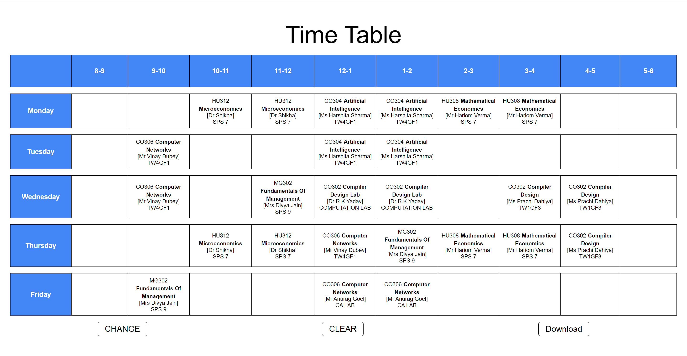
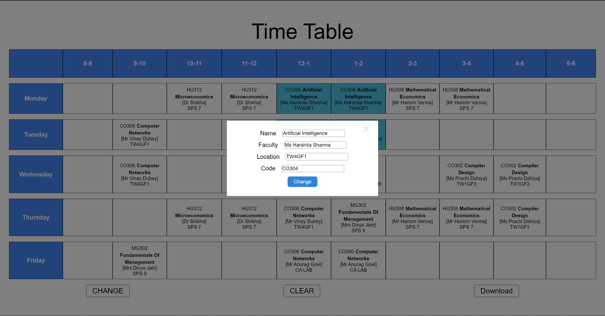

# Time Table Maker

## Demo link:
Access my site at [vivekranjan94.github.io/time-table-maker/](https://vivekranjan94.github.io/time-table-maker/)

## Table of Content:

- [About The App](#about-the-app)
- [Screenshots](#screenshots)
- [Technologies](#technologies)
- [Setup](#setup)
- [Status](#status)

## About The App
Time Table Maker is an easy tool to quickly create and download a college time-table. This is great for staying organized in a hectic environment.

## Screenshots

(Time Table)

(Modal with form)

## Technologies
I used `create-react-app`, `scss` for styles and `github-pages` for deployment. 

## Setup
- download or clone the repository
- run `npm install`
- run `npm start`
- start making your changes

## Status
Time Table Maker version 1 is currently completed. Further improvements/changes will be made based on user feedback.
